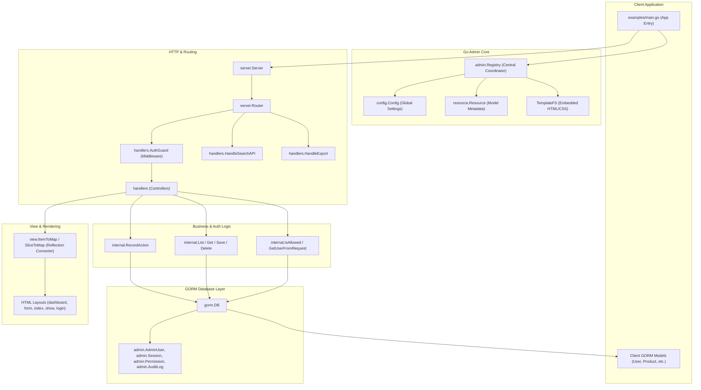

# Go Admin Architecture

This document describes the high-level architecture of the **Go Admin** framework. It highlights the main modules, their responsibilities, and how data flows through the application during an administrative request.

## Component Architecture

The diagram below illustrates the components of Go Admin and how they interact:

## Layer Responsibilities

### 1. **Core Layer (`admin`, `config`, `resource`)**
*   **[Registry](./registry.go#L44)**: Coordinates registered resources, configuration, custom pages, and dashboard charts. It acts as the central registry.
*   **[Config](./config/config.go#L11)**: Manages framework settings like theme colors, session time-to-lives (TTLs), default records per page, and upload folders.
*   **[Resource](./resource/resource.go#L66)**: Holds runtime metadata about GORM models, exposing configuration APIs to decorate columns, filter records with GORM scopes, specify field inputs, and configure relationships (`BelongsTo`/`HasMany`).

### 2. **HTTP & Routing Layer (`server`, `handlers`)**
*   **[Router](./server/router.go#L14)**: Inspects the request path and resolves it to a specific route category (Static upload assets, Auth actions, Search APIs, or main CRUD Resource controllers).
*   **[AuthGuard](./handlers/middleware.go#L10)**: Mid-flight middleware that restricts access only to authenticated users, redirecting guests to the login page.
*   **Handlers (Controllers)**: Handles client actions such as listing, rendering detailed views, serving forms, exporting CSV tables, and running custom user actions.

### 3. **Internal Helpers & Services Layer (`internal`)**
*   **[IsAllowed](./internal/auth.go#L13)**: Executes Role-Based Access Control (RBAC) checks by matching the user's role against permissions defined in the database.
*   **[RecordAction](./internal/audit.go#L12)**: Logs admin modifications to track who changed what.
*   **[CRUD Helpers](./internal/crud.go)**: Performs database manipulations (Select, Update, Insert, Delete) against GORM.

### 4. **Presentation & Formatting Layer (`view`, `templates`)**
*   **[Renderer](./view/renderer.go)**: Utilizes Go reflection (`reflect`) to read fields inside GORM structs and serialize them into generic string/HTML maps suitable for templates.
*   **Templates**: Native HTML, Tailwind/Vanilla CSS, and Chart.js dashboards packaged directly into the binary using `go:embed`.
